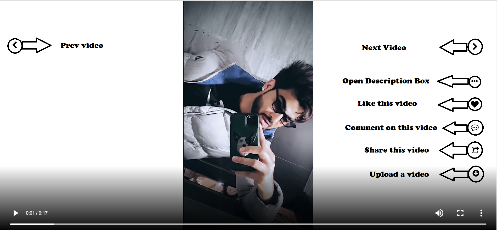
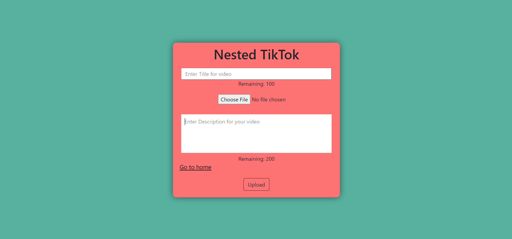
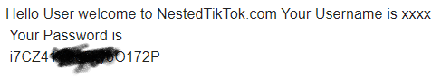

# tiktok

<h3>Home Page with lots of features.</h3>

<h3>Comments section of current video You can only see comments if you are not logged in.(canvas bottom)</h3>

<h3>Video description (canvasbottom)</h3>

<h3>Video Upload Page</h3>

<h3>Realtime word counter using javascript</h3>

<h3>Login page(currently forgot password field not added.)</h3>

<h3>Sign up page</h3>

<h4>You'll get a strong password on Registration via mail use that for login with username(email password login will be available soon.)</h4>

# bugs to be fixed

<h2>After posting a comment on video redirect user to /postcomment to /video so that form resubmission never occur.</h2>

# other bugs

<h2>Video gets deleted from server after 3-4hrs of upload <a href="https://db4free.net">database link</a>. Hosted at Heroku.</h2>

<h1>I need help to fix this bug.</h1>
